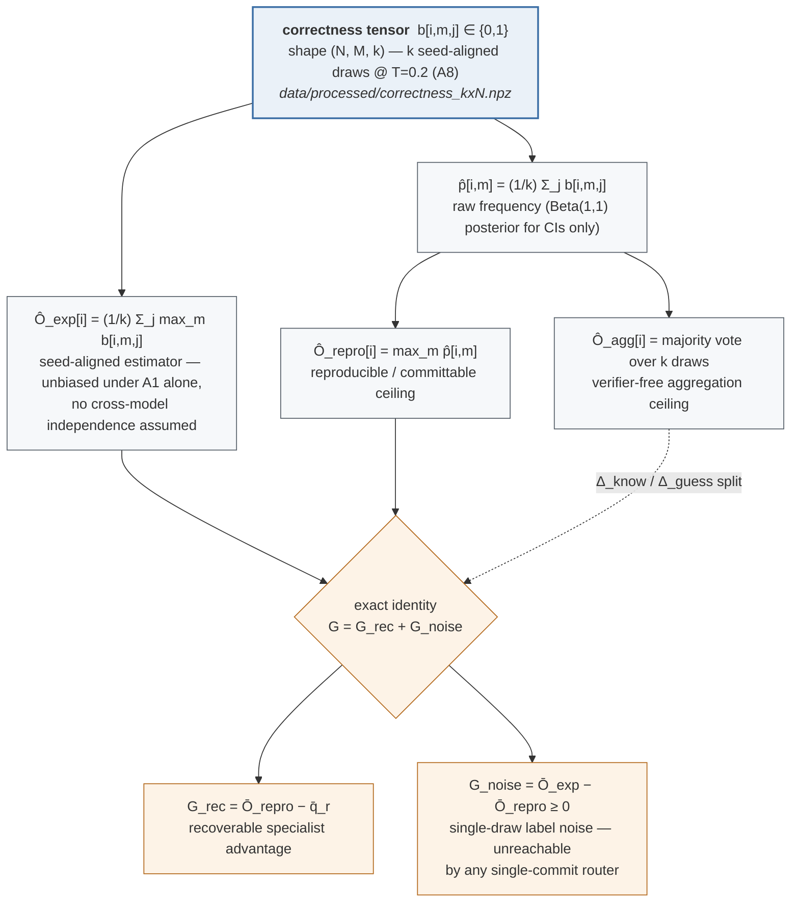
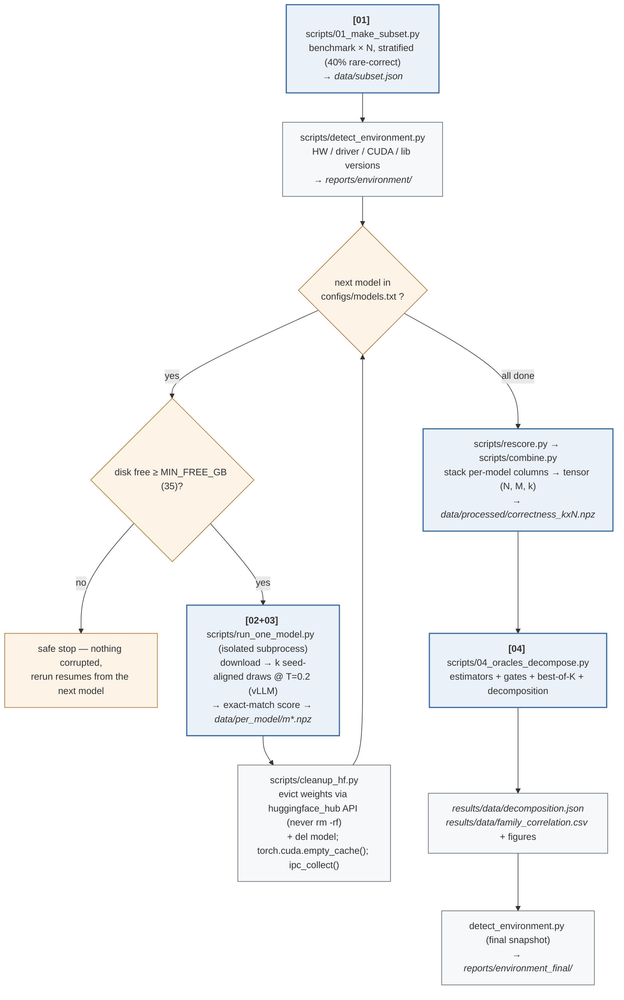
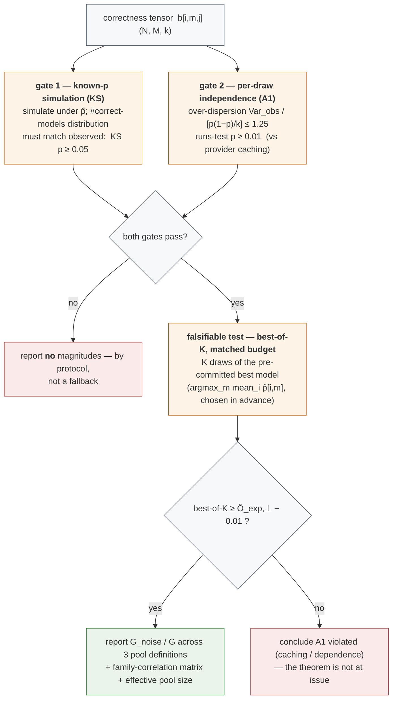

# routing-oracle-experiment

Reproduction code for the paper **"How Much of the Routing Gap Is Real?
Decomposing the Router-to-Oracle Gap into Reproducible Specialist Advantage and
Single-Draw Label Noise."**

> **What is proved vs. what is measured.** The paper's claims are *theorems* —
> they hold analytically and do **not** depend on any experiment. This code does
> one thing: it **measures the observable magnitudes** those theorems predict on a
> real, controlled open-weight pool (how large the single-draw noise share
> actually is), and it runs **falsifiable checks** on the two assumptions the
> magnitudes rely on (A1 per-draw independence, A8 seed alignment). If a check
> fails, the pipeline reports **no** magnitude — by design.

A reader who wants to understand the study without running anything can read this
file top to bottom: the two flowcharts below show *what is computed* and *how the
run is orchestrated*, and the tables map every artifact back to a section or
theorem of the paper.

---

## 1. Quick start (three commands)

```bash
# 0. install (install vLLM first — it pulls a matching torch build)
pip install -r requirements.txt

# 1. preflight — checks only; downloads nothing, runs nothing. Prints GO / NO-GO.
bash preflight.sh

# 2a. no-GPU smoke test (~30 s): validates the whole pipeline on simulated data
bash run_all.sh --smoke        # -> results/mvp/decomposition.json

# 2b. real run, disk-safe, one model at a time (needs GPU + vLLM)
bash run_sequential.sh                       # default: gsm8k, N=200, k=20
BENCH=gsm8k N=1000 K=30 bash run_sequential.sh   # fuller run
```

Environment variables understood by `run_sequential.sh`: `BENCH` (default `gsm8k`),
`N` (subset size, 200), `K` (draws per query-model, 20), `SEED` (42), `MAX_TOKENS`
(2048), `MIN_FREE_GB` (35 — the disk guard threshold), `MODELS`
(`configs/models.txt`), `PURGE` (1 = wipe all pool weights on exit).

---

## 2. What the pipeline computes (the three ceilings and the decomposition)

For each query `i` and model `m` we take `k` **seed-aligned** draws at the
benchmark temperature `T=0.2` and record a 0/1 correctness `b[i,m,j]`. From that
tensor we form three per-query ceilings and split the router-to-oracle gap:



The proved ordering is **`O_repro <= O_agg <= O_exp`**. `G_noise` is the part of
the headline gap that is *not* recoverable by choosing a better model to commit to
(it is only recoverable by test-time resampling — the *recoverability asymmetry*).
The empirical question this repo answers is **how big `G_noise` is** as a share of
`G` on a real pool.

Estimators are fixed in `configs/pool_open8.yaml` and implemented in
`src/oracles.py`:

- `O_exp` — **seed-aligned**: `mean_j max_m b[i,m,j]`. Unbiased under A1 alone
  (no independence assumption, no `O(1/k)` bias) because the max is taken *within*
  a seed-matched K-tuple.
- `O_exp,perp` — the independence envelope `1 - prod_m (1 - p_hat)` is reported
  **only as an upper bound**, and only when the covariance gate passes.
- `O_repro` — raw frequency `max_m p_hat` (never a Beta-posterior mean).
- Fréchet bracket `[max_m p_hat, min(sum_m p_hat, 1)]` is the assumption-free
  fallback used when A8 (per-draw seeds) cannot be honored.
- All magnitudes use a **one-sided, winner's-curse-corrected** lower bound
  (`R_k` added to `O_repro`, `R'_k` subtracted from `O_exp`), Bonferroni-split
  across strata.

---

## 3. How a run is orchestrated (disk-safe sequential runner)

`run_sequential.sh` is built for a small disk + 2×RTX 4090: it processes **one
model at a time** and frees its weights before the next, so peak disk use is about
one model (~29 GB), not the whole pool. It is **resumable** (finished models are
skipped) and leaves the VM clean on exit (including on Ctrl-C).



The tiny per-model columns (`data/per_model/*.npz`) are what make the run
resumable and cheap to move; **model weights and the HF cache are never committed
or transferred** (`.gitignore` excludes them).

---

## 4. Gates and the one falsifiable test (why the numbers are trustworthy)

Before any magnitude is reported, `04_oracles_decompose.py` runs two **gates** and
one **matched-budget falsifiable test**. Reviewers should note: this is the part
that keeps the empirical claim honest — a failure blocks the magnitude study
rather than being explained away.



To defend against the "same-family redundancy inflates `G_noise`" objection, the
decomposition is reported over **three pools** (full / one-model-per-lineage /
Qwen-scale-axis) and a **family error-correlation matrix** is emitted
(`results/data/family_correlation.csv`, with within- vs cross-lineage correlation
and an effective pool size).

---

## 5. Stage-by-stage reference

| Stage / file | Role | Key inputs → outputs |
|---|---|---|
| `scripts/01_make_subset.py` | build the query subset (stratified, oversamples the rare-correct stratum) | benchmark, `N`, seed → `data/subset.json` |
| `scripts/02_generate.py` | `k` seed-aligned draws at `T=0.2` via vLLM (or `--simulate` for smoke) | subset, config → raw generations |
| `scripts/03_score.py` | exact-match scoring → 0/1 correctness | generations → correctness columns |
| `scripts/run_one_model.py` | the disk-safe unit: download+generate+score+save for **one** model in a subprocess | model repo id → `data/per_model/m*.npz` |
| `scripts/cleanup_hf.py` | evict a model's weights from the HF cache via the safe hub API | model repo id → freed disk/GPU |
| `scripts/rescore.py` | re-score all saved columns under the current scorer (consistency) | `data/per_model/*` → rescored columns |
| `scripts/combine.py` | stack per-model columns into the `(N, M, k)` tensor | columns → `data/processed/correctness_kxN.npz` |
| `scripts/04_oracles_decompose.py` | corrected oracles + gates + best-of-K + decomposition | tensor → `results/data/decomposition.json` (+ figures, `family_correlation.csv`) |
| `scripts/detect_environment.py` | hardware / CUDA / library / git snapshot; `--anonymize` masks hostname & user | → `reports/environment*/` (json, md, and a paper-ready English paragraph) |

Core library (`src/`): `oracles.py` (the three ceilings + Fréchet bracket),
`decompose.py` (the `G = G_rec + G_noise` split), `generate.py` (vLLM,
seed-aligned sampling = A8), `score.py` (exact match), `stats.py` (bootstrap CIs,
McNemar, winner's-curse radius), `simulate.py` (known-`p` simulation for the smoke
run and the KS gate), `data.py` (dataset loaders).

---

## 6. The model pool

The pool is **`configs/models.txt`** (editable, preflight-verified — this is the
list the runner actually uses). `configs/pool_open8.yaml` is the reference for
sampling / gate / estimator parameters (its model list is illustrative and
superseded by `models.txt`).

| Model | Quant | GPUs | ~VRAM | Access |
|---|---|---|---|---|
| Mistral-7B-Instruct-v0.3 | fp16 | 1 | ~15 GB | open |
| DeepSeek-R1-Distill-Qwen-7B | fp16 | 1 | ~15 GB | open (long CoT) |
| Qwen2.5-7B-Instruct-AWQ | awq | 1 | ~6 GB | open |
| Qwen2.5-14B-Instruct-AWQ | awq | 1 | ~9 GB | open |
| Qwen2.5-32B-Instruct-AWQ | awq | 1 | ~20 GB | open |
| microsoft/phi-4 | fp16 | 2 | ~29 GB | open |
| allenai/OLMo-2-1124-7B-Instruct | fp16 | 1 | ~17 GB | open (distinct lineage) |
| 01-ai/Yi-1.5-9B-Chat | fp16 | 1 | ~20 GB | open (distinct lineage) |
| ibm-granite/granite-3.3-8b-instruct | fp16 | 1 | ~19 GB | open (distinct lineage) |
| google/gemma-2-9b-it | fp16 | 1 | ~18 GB | **gated** |
| meta-llama/Llama-3.1-8B-Instruct | fp16 | 1 | ~16 GB | **gated** |

Two deliberate design choices: **(i) text-only** — every model is a text
instruction model, because the single measured noise source must be decoding
randomness, not modality/answer-extraction mismatch; **(ii) break Qwen
dominance** — OLMo-2, Yi-1.5 and Granite add three distinct lineages so the noise
share cannot be dismissed as a same-family artifact. For gated models, run
`huggingface-cli login` and accept the license on the model page first.

---

## 7. Hardware and the environment report

Target hardware: **2×RTX 4090 (48 GB total, ~44 GB usable), 64 GB RAM**, small
disk. `detect_environment.py` runs at the start and end of every sequential run
and writes three files to `reports/environment/`:

- `environment_report.json` — raw, for exact reproduction;
- `environment_report.md` — human-readable;
- `paper_environment_summary.md` — the exact English paragraph used in the paper's
  system-configuration appendix (versions auto-filled).

Secrets (HF token, API keys, home-directory paths) are masked, so the reports are
safe to commit.

---

## 8. Honest caveats (please read before citing the numbers)

- **Gates can fail.** If provider caching breaks A1, or the KS gate rejects, `04`
  reports no magnitude. That is the intended behavior, not a bug.
- **`k` must be large enough.** In the thin-support (rare-correct) stratum the
  conservative lower bound is 0 for small `k`; use **`k >= 30`** there.
- **Primary vs. secondary evidence.** The primary empirical evidence is this
  controlled open-pool re-generation on standard benchmarks (GSM8K / MATH, clean
  gold). The paper's headline dataset, LLMRouterBench, has no public
  correctness matrix at time of writing; when it is released, connect it via
  `src/data.load_raw_correctness`. RouterBench's decoding parameters are not
  published and it is treated as a secondary corroborating example only.
- **This repo does not train a router.** It only re-estimates the oracle; the
  decomposition needs no new router.

---

## 9. Map to the paper

| Paper element | Where in this repo |
|---|---|
| Oracles `O_exp`, `O_repro`, `O_agg`; ordering (Prop. order) | `src/oracles.py`, config `oracles:` |
| Gap decomposition `G = G_rec + G_noise` (Decomposition Thm.) | `src/decompose.py`, `04_oracles_decompose.py` |
| Single-draw inflation / noise share (Cor. noise-share, gap-frac) | `04_oracles_decompose.py` outputs |
| Recoverability asymmetry (Thm.) — best-of-K vs selection | `best_of_k_test:` in config, `04` |
| A1 (per-draw independence) | independence / over-dispersion gate |
| A8 (seed alignment) | `src/generate.py` seed scheme; Fréchet fallback in `src/oracles.py` |
| System-configuration appendix (spec table) | `scripts/detect_environment.py` → `paper_environment_summary.md` |

---

*Questions or a mismatch between a number here and the paper? Open an issue — the
paper's magnitudes should always be reproducible from `results/data/` produced by
`run_sequential.sh`.*
