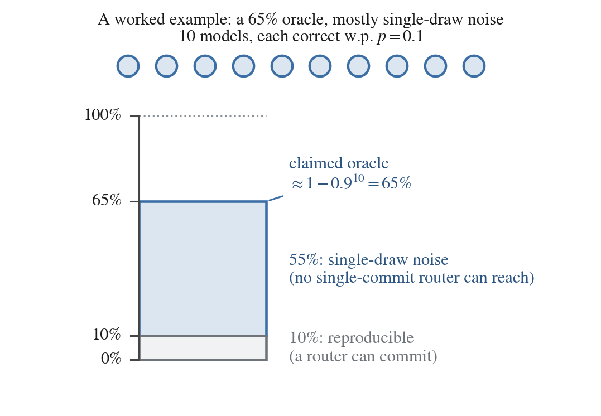
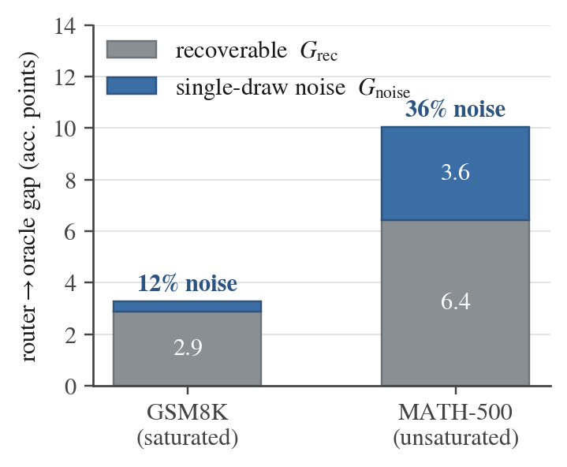
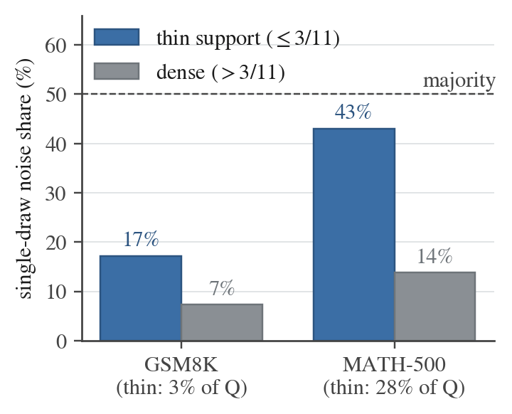
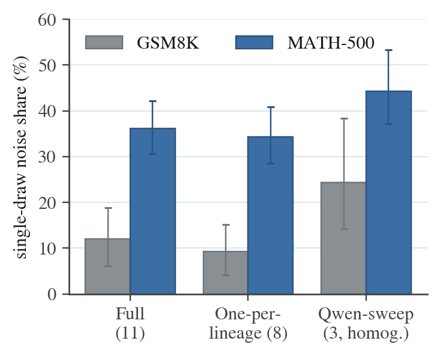
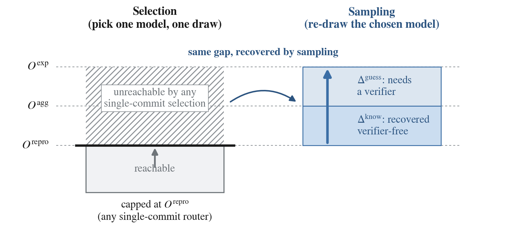
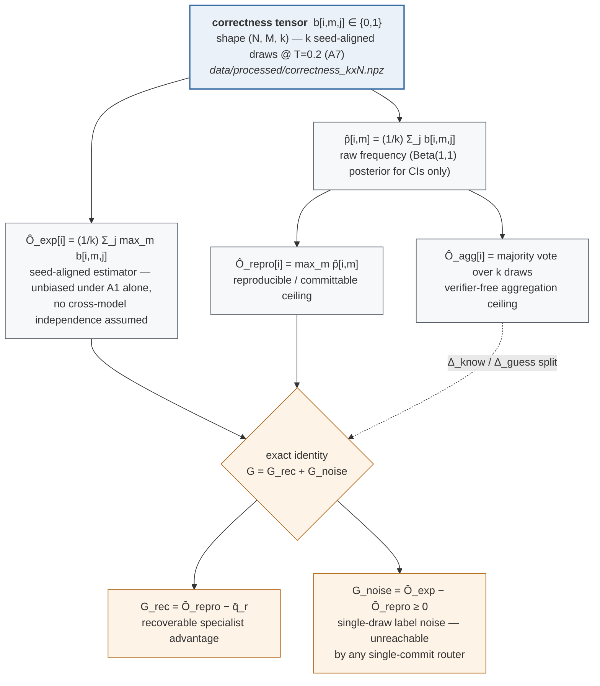
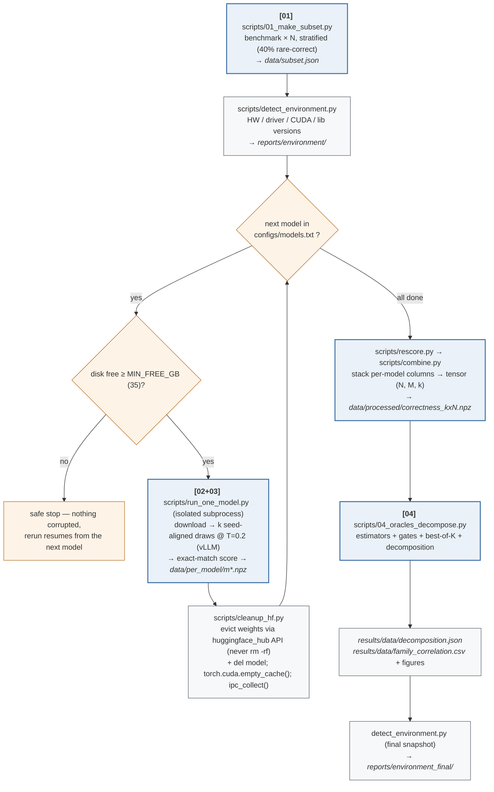
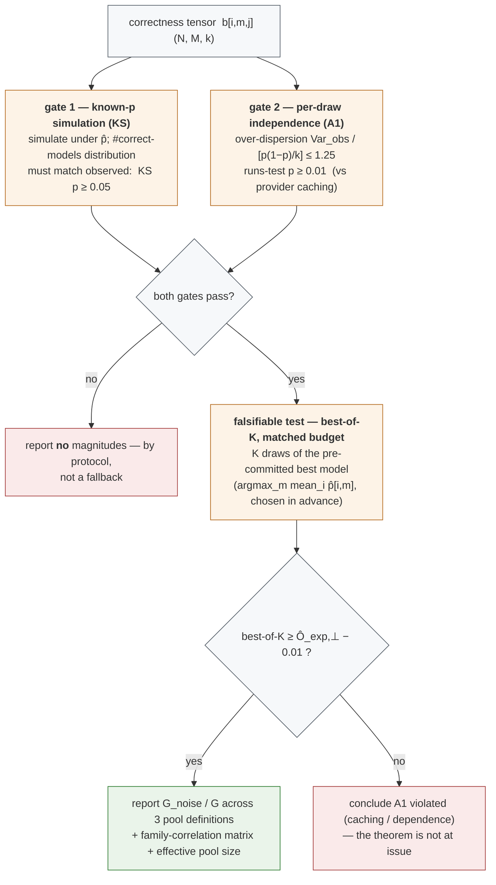

# How Much of the Routing Gap Is Real?


[](https://arxiv.org/abs/2607.03436)

> Reproducibility companion for the paper *“How Much of the Routing Gap Is Real?
> Decomposing the Router-to-Oracle Gap into Reproducible Specialist Advantage and
> Single-Draw Label Noise.”* **Open-weight, local, no API key** — every model is
> served with `vLLM` at a fixed temperature; no closed endpoint, no LLM API.
>
> **What is proved vs. what is measured.** The paper's claims are *theorems* —
> they hold analytically and do **not** depend on any experiment. This code does
> one thing: it **measures the empirical magnitude** those theorems predict on a
> real open-weight pool, and runs the two assumption **gates** and the single
> **falsifiable** check. If a gate fails, it reports *no* magnitude — by design.
>
> **Follow-up work.** The companion policy paper **“Resample or Reroute?”**
> ([arXiv:2607.08665](https://arxiv.org/abs/2607.08665)) turns this analysis into
> a deployable, budget-aware test-time policy, replayed directly on the
> correctness tensors released here — code:
> [resample-or-reroute-experiment](https://github.com/luka-krixvon/resample-or-reroute-experiment).

<p align="center">
  
</p>

*Hand-checkable intuition: with 10 models each correct with probability `p = 0.1`,
the single-draw oracle reaches `1 − 0.9¹⁰ ≈ 65%` — yet no model is reliable and a
router that commits to one model can reach only `10%`. Of the apparent `65%`, only
the `10%` reproducible mass (grey) is reachable by routing; the remaining `55%`
(blue) is single-draw label noise no router can capture — only test-time
resampling can.*

---

## TL;DR

LLM-routing benchmarks report a large gap between deployed routers and a
**per-instance oracle** — the model that is best on each query, in hindsight. But
that oracle is computed from **one** correctness label per (query, model), and
under stochastic decoding (`T > 0`) that label is a single Bernoulli draw. So the
oracle is a *maximum over noisy single draws* and inherits the upward bias that
inflates best-of-`N` estimates. We re-estimate per-(query, model) correctness as a
**probability** from `k ≥ 20` fresh draws, and split the router-to-oracle gap
exactly into

```
G  =  G_rec           +  G_noise
      recoverable         single-draw label noise
      specialist          (no single-commit router can
      advantage           recover it — only resampling)
```

The headline: single-draw noise is a **substantial minority** of the gap — larger
on an unsaturated benchmark, approaching half on the hardest queries — while the
**majority is genuine, recoverable specialist advantage**. And the noise obeys a
**recoverability asymmetry**: it is *uncapturable by selection* (any single-commit
router is capped at the reproducible ceiling `O^repro`) yet *recovered by test-time
sampling* on the committed model.

| Benchmark | router→oracle gap | **single-draw noise share** | recoverable |
|---|---:|---:|---:|
| **GSM8K** (saturated)      | 3.3 pts  | **12 %**  `[6, 19]`  | 88 % |
| **MATH-500** (unsaturated) | 10.0 pts | **36 %**  `[31, 42]` | 64 % |

Evidence: **11 open-weight models, 8 distinct pretraining lineages**, `k = 30`
seed-aligned draws per cell at `T = 0.2`, on two exact-match benchmarks
(`N = 500` stratified each), with both assumption gates passing and the
best-of-`K` recoverability check passing.

---

## Result 1 — The gap is majority-recoverable; noise is a real minority

<p align="center"></p>

*The router-to-oracle gap (accuracy points) splits into recoverable specialist
advantage `G_rec` (grey) and single-draw label noise `G_noise` (blue). Noise is the
minority slice on both benchmarks — larger in absolute terms on MATH-500 but still
a minority of the gap.*

|                                   | GSM8K (sat.) | MATH-500 (unsat.) |
|---|---:|---:|
| Recorded oracle `O^exp`           | 0.993 | 0.873 |
| Reproducible ceiling `O^repro`    | 0.989 | 0.837 |
| Best-single router                | 0.960 | 0.773 |
| Gap `G`                           | 0.033 | 0.100 |
| &nbsp;&nbsp;recoverable `G_rec`   | 0.029 | 0.064 |
| &nbsp;&nbsp;noise `G_noise`       | 0.004 | 0.036 |
| **Noise share** `G_noise / G`     | **12 %** `[6, 19]` | **36 %** `[31, 42]` |

The noise term is statistically real on both (nested-bootstrap lower bound `> 0`).
Its router-independent floor `O^exp − O^repro` grows from 0.4 to 3.6 points as the
pool goes from saturated to unsaturated.

## Result 2 — The noise concentrates exactly where no model is reliable

<p align="center"></p>

*Single-draw noise share by support stratum. Where no model is reliable
(thin support, ≤ 3 of 11 correct) the share is highest — **43 % on MATH-500**. But
MATH-500 is noise-heavier chiefly because it places far more queries there
(28 % vs 3 % of queries), a ~9× larger no-model-reliable population — the
`Θ(1 − p̄)` mechanism the theory predicts. Even in the worst stratum the share
stays below one half.*

## Result 3 — Correlated pools inflate the apparent gap

<p align="center"></p>

*Redundancy depresses the recoverable component while leaving decoding variance
untouched, so the noise share is highest for the most homogeneous pool and lowest
for the most decorrelated one — the direction the theory predicts.*

| Pool | `K` | GSM8K | MATH-500 |
|---|---:|---:|---:|
| Full                           | 11 | 12 % | 36 % |
| One-per-lineage (diverse)      | 8  | 9 %  | 34 % |
| Qwen size-sweep (homogeneous)  | 3  | 24 % | 44 % |

Cross-model error correlation is high (within-lineage exceeds cross-lineage), so
the **effective pool size is only 2.1–3.5 of 11**: eleven models behave like two to
three independent ones. The one-per-lineage pool is the conservative headline.

## Recoverability check (the single falsifiable prediction)

The prediction that test-time **sampling** recovers what **selection** cannot
passes on both benchmarks: best-of-`K` on the per-query committed best model
reaches **0.946** on MATH-500, exceeding the matched-budget independent-pool oracle
`O^exp,⊥ = 0.874`. Recovery *scope* is verifier-gated: a single-round majority vote
reaches only **0.824** — below the reproducible ceiling **0.837** — so the
sampling-recoverable mass is dominated by the guessing residual, reclaimable only
with a deploy-time verifier, not by aggregation alone.

## Why it happens

<p align="center"></p>

*The recoverability asymmetry. On the **selection** axis every single-commit
router — deterministic, randomized, or any mixture — is capped at `O^repro`; the
hatched mass above it is unreachable by choosing a model in advance, and this cap
needs no cross-model independence. On the **sampling** axis the same per-query draw
budget, spent as best-of-`K` on the committed model, provably lifts performance
through the verifier-free aggregation ceiling toward `O^exp`.*

---

## How the pipeline works (experiment flow)

**(1) What is computed.** For each query `i` and model `m` we take `k`
**seed-aligned** draws at `T = 0.2` and record a 0/1 correctness `b[i,m,j]`. From
that `(N, M, k)` tensor we form three per-query ceilings and split the gap:


```mermaid
flowchart TD
    T["<b>correctness tensor</b>  b[i,m,j] ∈ {0,1}<br/>shape (N, M, k) — k seed-aligned draws @ T=0.2 (A7)<br/><i>data/processed/correctness_kxN.npz</i>"]
    T --> PE["p̂[i,m] = (1/k) Σ_j b[i,m,j]<br/>raw frequency (Beta(1,1) posterior for CIs only)"]
    T --> OE["Ô_exp[i] = (1/k) Σ_j max_m b[i,m,j]<br/>seed-aligned estimator — unbiased under A1 alone,<br/>no cross-model independence assumed"]
    PE --> OR["Ô_repro[i] = max_m p̂[i,m]<br/>reproducible / committable ceiling"]
    PE --> OA["Ô_agg[i] = majority vote over k draws<br/>verifier-free aggregation ceiling"]
    OE --> DEC{"exact identity<br/>G = G_rec + G_noise"}
    OR --> DEC
    DEC --> GR["G_rec = Ō_repro − q̄_r<br/>recoverable specialist advantage"]
    DEC --> GN["G_noise = Ō_exp − Ō_repro ≥ 0<br/>single-draw label noise — unreachable<br/>by any single-commit router"]
    OA -.->|"Δ_know / Δ_guess split"| DEC
    classDef data fill:#eaf1f8,stroke:#3b6ea5,stroke-width:2px;
    classDef est fill:#f6f8fa,stroke:#57606a;
    classDef out fill:#fdf3e7,stroke:#b46a1e;
    class T data; class PE,OE,OR,OA est; class DEC,GR,GN out;
```

The proved ordering is **`O_repro ≤ O_agg ≤ O_exp`**. `G_noise` is the part of the
gap that is *not* recoverable by choosing a better model to commit to — only by
test-time resampling (the **recoverability asymmetry**). The empirical question
this repo answers is **how big `G_noise` is** as a share of `G` on a real pool.

**(2) How a run is orchestrated** — disk-safe, one model at a time. Built for a
small disk + 2×RTX 4090: process one model, free its weights, then the next
(peak disk ≈ one model, not the whole pool). Resumable; leaves the machine clean
on exit, including on Ctrl-C.


```mermaid
flowchart TD
    S["<b>[01]</b> scripts/01_make_subset.py<br/>benchmark × N, stratified (40% rare-correct)<br/>→ <i>data/subset.json</i>"] --> ENV["scripts/detect_environment.py<br/>HW / driver / CUDA / lib versions<br/>→ <i>reports/environment/</i>"]
    ENV --> L{"next model in<br/>configs/models.txt ?"}
    L -->|yes| G{"disk free ≥ MIN_FREE_GB (35)?"}
    G -->|no| STOP["safe stop — nothing corrupted,<br/>rerun resumes from the next model"]
    G -->|yes| SUB["<b>[02+03]</b> scripts/run_one_model.py  (isolated subprocess)<br/>download → k seed-aligned draws @ T=0.2 (vLLM)<br/>→ exact-match score → <i>data/per_model/m*.npz</i>"]
    SUB --> EV["scripts/cleanup_hf.py<br/>evict weights via huggingface_hub API (never rm -rf)<br/>+ del model; torch.cuda.empty_cache(); ipc_collect()"]
    EV --> L
    L -->|all done| RS["scripts/rescore.py → scripts/combine.py<br/>stack per-model columns → tensor (N, M, k)<br/>→ <i>data/processed/correctness_kxN.npz</i>"]
    RS --> D["<b>[04]</b> scripts/04_oracles_decompose.py<br/>estimators + gates + best-of-K + decomposition"]
    D --> OUT["<i>results/data/decomposition.json</i><br/><i>results/data/family_correlation.csv</i> + figures"]
    OUT --> ENV2["detect_environment.py (final snapshot)<br/>→ <i>reports/environment_final/</i>"]
    classDef stage fill:#eaf1f8,stroke:#3b6ea5,stroke-width:2px;
    classDef guard fill:#fdf3e7,stroke:#b46a1e;
    classDef io fill:#f6f8fa,stroke:#57606a;
    class S,SUB,RS,D stage; class L,G,STOP guard; class ENV,EV,OUT,ENV2 io;
```

The tiny per-model columns (`data/per_model/*.npz`) make the run resumable and
cheap to move; **model weights and the HF cache are never committed or
transferred** (`.gitignore` excludes them).

**(3) Gates + the one falsifiable test** — why the numbers are trustworthy.
Before any magnitude is reported, `04_oracles_decompose.py` runs two **gates** and
one **matched-budget falsifiable test**; a failure **blocks** the magnitude study
rather than being explained away.


```mermaid
flowchart TD
    C["correctness tensor  b[i,m,j]  (N, M, k)"] --> KS["<b>gate 1 — known-p simulation (KS)</b><br/>simulate under p̂; #correct-models distribution<br/>must match observed:  KS p ≥ 0.05"]
    C --> IND["<b>gate 2 — per-draw independence (A1)</b><br/>over-dispersion Var_obs / [p(1−p)/k] ≤ 1.25<br/>runs-test p ≥ 0.01  (vs provider caching)"]
    KS --> P{"both gates pass?"}
    IND --> P
    P -->|no| BLOCK["report <b>no</b> magnitudes — by protocol,<br/>not a fallback"]
    P -->|yes| BOK["<b>falsifiable test — best-of-K, matched budget</b><br/>K draws of the pre-committed best model<br/>(argmax_m mean_i p̂[i,m], chosen in advance)"]
    BOK --> PASS{"best-of-K ≥ Ô_exp,⊥ − 0.01 ?"}
    PASS -->|yes| REPORT["report G_noise / G across 3 pool definitions<br/>+ family-correlation matrix + effective pool size"]
    PASS -->|no| A1["conclude A1 violated (caching / dependence)<br/>— the theorem is not at issue"]
    classDef gate fill:#fdf3e7,stroke:#b46a1e;
    classDef ok fill:#eaf4ea,stroke:#2f7d32;
    classDef bad fill:#faeaea,stroke:#a33a3a;
    classDef io fill:#f6f8fa,stroke:#57606a;
    class KS,IND,BOK gate; class P,PASS io; class REPORT ok; class BLOCK,A1 bad; class C io;
```

### Stage-by-stage

| Stage / file | Role | Key inputs → outputs |
|---|---|---|
| `scripts/01_make_subset.py` | build the query subset (stratified, oversamples the rare-correct stratum) | benchmark, `N`, seed → `data/subset.json` |
| `scripts/02_generate.py` | `k` seed-aligned draws at `T=0.2` via vLLM (or `--simulate` for the smoke run) | subset, config → raw generations |
| `scripts/03_score.py` | exact-match scoring → 0/1 correctness | generations → correctness columns |
| `scripts/run_one_model.py` | the disk-safe unit: download + generate + score + save for **one** model in a subprocess | model repo id → `data/per_model/m*.npz` |
| `scripts/cleanup_hf.py` | evict a model's weights from the HF cache via the safe hub API | model repo id → freed disk/GPU |
| `scripts/rescore.py` · `combine.py` | re-score under the current scorer, then stack columns into the tensor | `data/per_model/*` → `correctness_kxN.npz` |
| `scripts/04_oracles_decompose.py` | corrected oracles + gates + best-of-K + decomposition | tensor → `results/data/decomposition.json` (+ figures, `family_correlation.csv`) |
| `scripts/detect_environment.py` | hardware / CUDA / library / git snapshot (`--anonymize` masks host & user) | → `reports/environment*/` |

---

## Repository layout

```
routing-oracle-experiment/
├── src/                          # library (imported by the scripts)
│   ├── oracles.py                    # O^exp / O^repro / O^agg + Fréchet bracket
│   ├── decompose.py                  # exact gap decomposition  G = G_rec + G_noise
│   ├── generate.py                   # vLLM generation; seed-aligned draws (A7)
│   ├── score.py                      # exact-match scoring
│   ├── stats.py                      # bootstrap CIs, winner's-curse radius, tests
│   ├── simulate.py                   # known-p simulation (smoke run + KS gate)
│   └── data.py                       # dataset loaders
├── scripts/                      # pipeline stages (run from the repo root)
│   ├── 01_make_subset.py             # stratified query subset (oversamples thin support)
│   ├── 02_generate.py                # k seed-aligned draws @ T=0.2  (or --simulate, no GPU)
│   ├── 03_score.py                   # → correctness tensor  (N, M, k)
│   ├── 04_oracles_decompose.py       # oracles + gates + best-of-K + decomposition
│   ├── run_one_model.py              # disk-safe unit: download → generate → score → evict
│   ├── cleanup_hf.py                 # evict weights from the HF cache (safe hub API)
│   ├── combine.py · rescore.py       # assemble / re-score per-model columns
│   └── detect_environment.py         # hardware / CUDA / version snapshot for the paper
├── configs/
│   ├── models.txt                    # the 11-model open-weight pool (edit here)
│   └── pool_open8.yaml               # sampling / gate / estimator parameters
├── figures/                      # the paper figures shown in this README
├── run_sequential.sh             # disk-safe end-to-end runner (one model at a time)
├── run_all.sh                    # simple chain · --smoke (no-GPU pipeline validation)
├── preflight.sh                  # GO/NO-GO checks (disk, GPU, model reachability)
└── tests/test_oracles.py
```

## Install

```bash
pip install -r requirements.txt          # install vLLM first; it pulls a matching torch
```

## Reproduce (fast — no GPU, ~30 s)

Validates the whole pipeline on simulated correctness:

```bash
bash run_all.sh --smoke                  # → results/mvp/decomposition.json
```

## Reproduce the results from scratch (GPU)

```bash
bash preflight.sh                        # checks only; prints GO / NO-GO
bash run_sequential.sh                   # disk-safe, one model at a time
BENCH=gsm8k N=1000 K=30 bash run_sequential.sh   # fuller run
```

`run_sequential.sh` processes **one model at a time** — download → `k` seed-aligned
draws → exact-match score → save the tiny per-model column → **evict the weights**
(safe hub API, never `rm -rf`) → free the GPU → next. Peak disk ≈ one model, and it
is **resumable**. It ends by assembling the `(N, M, k)` tensor and running
`04_oracles_decompose.py` (corrected oracles + gates + best-of-`K` + decomposition
→ `results/data/decomposition.json`). `detect_environment.py` records the exact
hardware/CUDA/library stack (masking secrets) for the paper's system-configuration
appendix.

## The model pool & data

**Pool** (`configs/models.txt`, edit freely): 11 open-weight **text-only**
instruction models across **8 pretraining lineages** — Mistral-7B,
DeepSeek-R1-Distill-Qwen-7B, Qwen2.5-{7,14,32}B, Phi-4, OLMo-2-7B, Yi-1.5-9B,
Granite-3.3-8B, Gemma-2-9B, Llama-3.1-8B. Text-only by design: the one measured
noise source must be decoding stochasticity, not modality / answer-extraction
mismatch. OLMo-2, Yi-1.5 and Granite were added so no single lineage dominates.

**Benchmarks**: GSM8K (saturated) and MATH-500 (unsaturated), exact-match, clean
gold. Provider caching / per-draw dependence is guarded by an independence gate;
the known-`p` simulation gate checks the #-correct-models distribution before any
magnitude is reported.

## What is *not* in this repository (by design)

- **LLMRouterBench's per-cell correctness matrix.** It is the paper's *primary
  audit target* (33 models, 391,645 instances; its ~20-point oracle gap is, by
  construction, a union of single `T = 0.2` draws), but its raw matrix is not
  publicly released, and `O^repro` is non-identifiable from a `k = 1` matrix. So
  this repository runs a **controlled open-pool re-generation** on standard
  benchmarks instead; connect LLMRouterBench via `src/data.load_raw_correctness`
  when its data becomes available.
- **Closed-model endpoints.** Recovering `O^exp` and `O^repro` needs *new,
  seed-pinned* per-cell generation at a fixed temperature, which closed APIs
  neither guarantee nor expose — hence open weights, and **no API key**.
- **Vision-language models.** Admitting them on text benchmarks would make input
  modality and answer extraction heterogeneous and inject non-decoding variance
  outside the seed-aligned model.

## Map to the paper

| Paper element | Where in this repo |
|---|---|
| Oracles `O^exp` / `O^repro` / `O^agg`; ordering (Prop. order) | `src/oracles.py`, `configs/pool_open8.yaml` (`oracles:`) |
| Exact gap decomposition `G = G_rec + G_noise` (Decomposition Thm.) | `src/decompose.py`, `scripts/04_oracles_decompose.py` |
| Single-draw inflation / noise share (Cor. noise-share, gap-frac) | `04_oracles_decompose.py` outputs |
| Recoverability asymmetry (Thm.) — best-of-K vs selection | `best_of_k_test:` in config, `04_oracles_decompose.py` |
| A1 (per-draw independence) | independence / over-dispersion gate |
| A7 (seed alignment) | `src/generate.py` seed scheme; Fréchet fallback in `src/oracles.py` |
| System-configuration appendix (spec table) | `scripts/detect_environment.py` → `paper_environment_summary.md` |

## Citation

If you use this code or its findings, please cite the preprint:

> Teng-Ruei Chen. **How Much of the Routing Gap Is Real? Decomposing the
> Router-to-Oracle Gap into Reproducible Specialist Advantage and Single-Draw
> Label Noise.** arXiv:2607.03436 [cs.LG], 2026.
> <https://arxiv.org/abs/2607.03436>

If you use the budget-aware resample-or-reroute policy built on these tensors,
please also cite the follow-up paper:

> Teng-Ruei Chen. **Resample or Reroute? Budget-Aware Test-Time Model Selection
> for Large Language Models.** arXiv:2607.08665 [cs.LG], 2026.
> <https://arxiv.org/abs/2607.08665>

```bibtex
@article{chen2026routinggap,
  title   = {How Much of the Routing Gap Is Real? Decomposing the Router-to-Oracle
             Gap into Reproducible Specialist Advantage and Single-Draw Label Noise},
  author  = {Chen, Teng-Ruei},
  journal = {arXiv preprint arXiv:2607.03436},
  year    = {2026},
  doi     = {10.48550/arXiv.2607.03436},
  url     = {https://arxiv.org/abs/2607.03436}
}
```

Machine-readable metadata is in [`CITATION.cff`](CITATION.cff).

<!-- JOURNAL VERSION — once the peer-reviewed version is accepted, add the venue,
     year, and DOI here and update the journal/doi fields in CITATION.cff. -->

## License

[MIT](LICENSE). © 2026 Teng-Ruei Chen.
